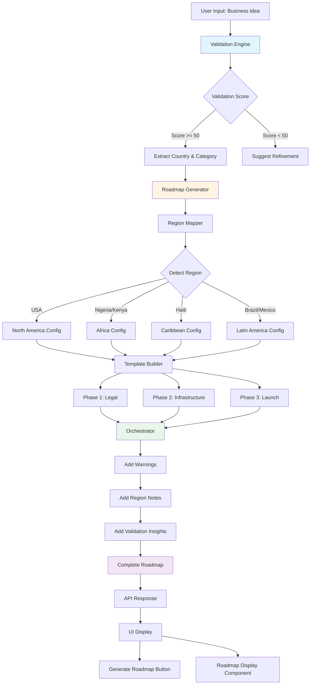

# System Architecture

## Component Interaction

```
┌─────────────────────────────────────────────────────────────┐
│                         USER FLOW                            │
├─────────────────────────────────────────────────────────────┤
│                                                              │
│  1. User enters business idea                               │
│     ↓                                                        │
│  2. Validation API analyzes idea                            │
│     ↓                                                        │
│  3. Returns: Score, Category, Country, Risks                │
│     ↓                                                        │
│  4. If score >= 50: Show "Generate Roadmap" button          │
│     ↓                                                        │
│  5. User clicks → Roadmap API called                        │
│     ↓                                                        │
│  6. Roadmap generated based on country + business type      │
│     ↓                                                        │
│  7. Display 3-phase plan with region-specific guidance      │
│                                                              │
└─────────────────────────────────────────────────────────────┘

┌─────────────────────────────────────────────────────────────┐
│                      DATA STRUCTURES                         │
├─────────────────────────────────────────────────────────────┤
│                                                              │
│  RoadmapInput                                               │
│  ├─ idea: string                                            │
│  ├─ country: string                                         │
│  ├─ businessType: string                                    │
│  └─ validationData?: object                                 │
│                                                              │
│  RoadmapOutput                                              │
│  ├─ phase_1_legal                                           │
│  │   ├─ step_name                                           │
│  │   ├─ description                                         │
│  │   ├─ estimated_cost                                      │
│  │   └─ estimated_timeline                                  │
│  ├─ phase_2_infrastructure                                  │
│  ├─ phase_3_launch                                          │
│  ├─ warnings: string[]                                      │
│  └─ region_specific_notes: string[]                         │
│                                                              │
└─────────────────────────────────────────────────────────────┘

┌─────────────────────────────────────────────────────────────┐
│                    REGION CONFIGURATION                      │
├─────────────────────────────────────────────────────────────┤
│                                                              │
│  RegionConfig                                               │
│  ├─ region: string                                          │
│  ├─ countries: string[]                                     │
│  ├─ currency: string                                        │
│  ├─ legal_structure: string[]                               │
│  ├─ banking_providers: string[]                             │
│  ├─ payment_processors: string[]                            │
│  ├─ marketing_channels: string[]                            │
│  └─ common_warnings: string[]                               │
│                                                              │
└─────────────────────────────────────────────────────────────┘
```

## Request Flow

```
Client → POST /api/roadmap
         │
         ├─ Body: { idea, country, businessType, validationData }
         │
         ↓
    orchestrator.ts
         │
         ├─ Call: getRegionConfig(country)
         │  └─ Returns: RegionConfig
         │
         ├─ Call: buildLegalPhase(regionConfig, country)
         │  └─ Returns: Phase 1 details
         │
         ├─ Call: buildInfrastructurePhase(regionConfig, businessType)
         │  └─ Returns: Phase 2 details
         │
         ├─ Call: buildLaunchPhase(regionConfig, businessType)
         │  └─ Returns: Phase 3 details
         │
         ├─ Compile warnings from regionConfig + defaults
         │
         └─ Add validation-based warnings if present
         
         ↓
    Return RoadmapOutput
         │
         ↓
Client ← JSON Response
```

## Country Detection Logic

```
Input: country = "Nigeria"
         │
         ↓
   regionMapper.ts
         │
         ├─ Normalize: "NIGERIA"
         │
         ├─ Check mapping: 
         │   NG → africa_nigeria
         │   NIGERIA → africa_nigeria
         │
         ├─ Lookup REGION_CONFIGS['africa_nigeria']
         │
         └─ Return: {
               region: 'Africa',
               currency: 'NGN',
               legal_structure: ['CAC Registration', ...],
               banking_providers: ['Paystack', 'Flutterwave', ...],
               ...
             }
```

## Template Selection

```
buildLegalPhase(regionConfig, "Nigeria")
         │
         ↓
   templateBuilder.ts
         │
         ├─ Match country: "Nigeria"
         │
         ├─ Select template: 'africa_nigeria'
         │
         └─ Return: {
               step_name: "CAC Registration & Tax Setup",
               description: "...",
               estimated_cost: "₦50,000-₦100,000 NGN",
               estimated_timeline: "2-4 weeks"
             }
```

## Business Type Adaptation

```
buildInfrastructurePhase(regionConfig, "marketplace")
         │
         ↓
   Look up BUSINESS_TYPE_GUIDANCE['marketplace']
         │
         └─ {
               infrastructure_focus: "Two-sided platform, Payment escrow, Ratings",
               launch_strategy: "Supply-side first, demand generation",
               key_metrics: "GMV, Take rate, Active sellers/buyers"
             }
         │
         ↓
   Combine with regionConfig
         │
         ├─ Banking: regionConfig.banking_providers
         ├─ Payments: regionConfig.payment_processors
         ├─ Tech Stack: business type guidance
         │
         └─ Return: Phase 2 with marketplace-specific + Nigeria-specific advice
```

## Warning Aggregation

```
Compile Warnings
         │
         ├─ Region warnings (e.g., "Get TIN from FIRS")
         │
         ├─ Default warnings (e.g., "Budget 20% more")
         │
         ├─ Validation warnings (if present)
         │   └─ "⚠️ Address payment infrastructure risks"
         │
         └─ Return: Combined array of warnings
```

## Frontend Component Flow

```
<ValidationRoadmapFlow>
         │
         ├─ State: step = 'input' | 'validating' | 'validated' | 'roadmap'
         │
         ├─ Step 1: User enters idea
         │   └─ POST /api/validate
         │
         ├─ Step 2: Show validation results
         │   └─ Extract country & businessType
         │
         ├─ Step 3: User clicks "Generate Roadmap"
         │   └─ <GenerateRoadmapButton>
         │       └─ POST /api/roadmap
         │
         └─ Step 4: Display roadmap
             └─ <RoadmapDisplay>
                 ├─ Phase 1 Card
                 ├─ Phase 2 Card
                 ├─ Phase 3 Card
                 └─ Warnings Alert
```

## Error Handling

```
try {
  generateRoadmap(input)
} catch (error) {
  │
  ├─ Country not supported?
  │   └─ Suggest: "Notify me" or "Use generic plan"
  │
  ├─ Missing required fields?
  │   └─ Return 400: "Missing idea, country, or businessType"
  │
  ├─ Template not found?
  │   └─ Fallback to USA template
  │
  └─ Unknown error?
      └─ Return 500: "Failed to generate roadmap"
}
```
